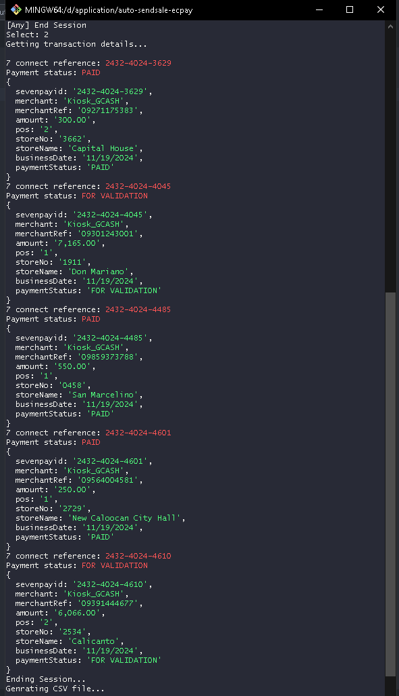

# 7connect Auto Send Sale Script

This guide will walk you through the steps to clone a repository, install dependencies, and run the application.

## Prerequisites

- **Node.js** (version 14 or later recommended)
- **Git**

Check NodeJS Version

```cmd
node -v or node --version 
```


# Steps

**1. Run Git Bash**

   Open any folder, right-click, select **Open Git Bash Here** and type the following command on the terminal.  <br><br>


Create a directory
   
```cmd
mkdir application
```

  Go to application directory

```cmd
cd application
```

**2. Clone the project and install dependencies**

   To clone the project, and install dependencies, type the following commands

```bash
git clone https://github.com/encinares16/auto-sendsale-ecpay.git
```

```cmd
cd auto-sendsale-ecpay
```

Installing dependencies

```cmd
npm install
```

# Running The Application

**1. Edit .env file (7connect credential)**
```bash
Open VS Code and edit the environment variable.
PROD_SEVEN_CONNECT_USERNAME=auto_send_sale
PROD_SEVEN_CONNECT_PASS=YOURPASSWORDHERE
```


**2. Add 7connect references in the text file. References.txt**


**2. Run the Application**
 
To run the application using the terminal, type node app.js. The script will just automate browser navigation, allowing you to manually to process send sale.
Browser shortcuts: next tab ***CTRL+TAB***, previous tab hold ***CTRL & SHIFT + T***, close tab ***CTRL + W***

```bash
node app.js
```


**Option 1: Restart Application**
In the menu, select Option 1 to restart the app. You can edit references.txt and add the next batch of entries. <br><br>


**Option 2: Check Transaction Status**
In the menu, select Option 2 to check the transaction status and append the declined transactions to the CSV file located in the output folder.<br><br>
<br><br>

